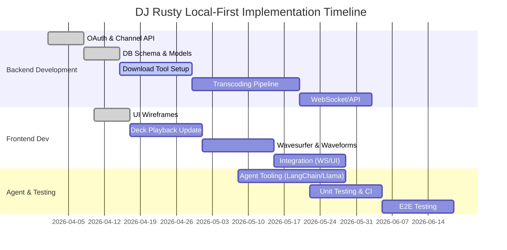

# Executive Summary  
DJ Rusty is a React/TypeScript two-deck DJ app currently using YouTube IFrames for playback and Google OAuth for login. To make it local-first, we will **download the user’s own YouTube channel audio**, transcode to MP3/WAV, and serve it locally, while preserving the existing UI/UX and keyboard shortcuts. We define a Node.js/TypeScript backend that: authenticates with YouTube (OAuth, `youtube.readonly` scope) to fetch the user’s channel video IDs, invokes open-source tools (yt-dlp or ytdl-core) to download each video’s audio stream, uses FFmpeg to transcode to MP3/WAV, and stores files with metadata in a local SQLite+filesystem. The frontend will continue to use the YouTube IFrame player when no local file exists, but will fall back to playing the local file via Web Audio (Howler/Wavesurfer) when available. We design WebSocket and REST APIs for controlling downloads and playback (with JSON message schemas), and an AI agent layer (LangChain TS) using **Llama 3 8B (4-bit quantized)** for orchestrating tasks (download, retry, metadata extraction). We compare download/transcode libraries in a summary table, specify exact TypeScript interfaces and example messages, and present an implementation plan with effort estimates, plus testing strategies (mocking YouTube, CI playback). All solutions use open-source components only.  

## 1. DJ Rusty Features & Gaps  
DJ Rusty currently offers: Google OAuth2 sign-in, YouTube search, and full DJ controls on two decks (play/pause, cue, pitch fader with 8 rates, tap tempo, beat jump, sync, 8 hot cues, loops/rolls, slip mode, basic (volume) EQ, VU meters, faders, crossfader, etc.). It uses the YouTube IFrame API for playback, so it **lacks any local file playback or waveform display**, and EQ is only volume control. The main gaps to implement are:  
- **Channel Downloads:** Ability to download audio of videos from the signed-in user’s YouTube channel.  
- **Local Audio Files:** Store and play back MP3/WAV on-demand instead of always streaming from YouTube.  
- **Waveforms & Effects:** Show waveforms (e.g. via Wavesurfer.js) and apply real EQ/effects using Web Audio (since IFrames cannot).  
- **Persistence:** Save downloaded files, metadata (ID3 tags), hot cues/loops per local file.  
- **Offline Operation:** Use local player (Howler/Web Audio) when offline or no Internet.  
- **API Flow:** Provide UI for initiating downloads (e.g. “sync channel”), showing progress, and switching decks to local files.  

## 2. YouTube API Access (Channel Video Downloads)  
To download a user’s own videos, the backend will use YouTube Data API v3 **with OAuth**. Key points:  

- **OAuth Scopes:** The app must request `https://www.googleapis.com/auth/youtube.readonly` (the “youtube.readonly” scope) so it can list and read the user’s uploaded videos【80†L478-L487】【80†L543-L551】. This allows read-only access to the authenticated user’s channel.  

- **Listing Videos:** First call `channels.list(part="contentDetails", mine=true)` to get the authenticated user’s channel resource. This returns `contentDetails.relatedPlaylists.uploads`, the special playlist ID containing all uploaded videos【80†L478-L487】. Then call `playlistItems.list(part="snippet", playlistId=UPLOADS_ID, maxResults=50, pageToken=…)` to page through the uploaded videos and collect each video’s ID and title【80†L498-L507】. (Alternatively, you could call `videos.list(id=VIDEO_ID, part="snippet,contentDetails")` to get metadata.)  

- **Quota:** Both `channels.list` and `playlistItems.list` cost **1 unit each**【82†L193-L201】【85†L197-L200】. The default quota is 10,000 units/day. Listing a few dozen videos consumes negligible quota (1–2 units per page). Using the API for metadata (titles, duration) is safe; actual media download is done via other tools.  

- **API Endpoints Summary:** 
  - `GET https://www.googleapis.com/youtube/v3/channels?part=contentDetails&mine=true` – Get channel’s uploads playlist ID【80†L478-L487】.
  - `GET https://www.googleapis.com/youtube/v3/playlistItems?part=snippet&playlistId={uploadsId}&maxResults=50` – List videos (loop pages)【80†L498-L507】.
  - (Optional) `videos.list` to get durations or tags.  

- **Terms of Service:** YouTube’s ToS generally forbid downloading videos except through approved means. Since this app only downloads videos **that the user themselves uploaded**, it is typically allowed (the user has rights to their own content). However, the app must ensure it only accesses the authenticated user’s channel, never downloading unauthorized content. Also the developer should comply with any rate limits (use exponential backoff on 429s).  

## 3. Download & Transcoding Tools  

We compare popular open-source tools for retrieving YouTube audio:

| Tool             | TypeScript Support | License               | Maintenance        | Audio-Only   | CI-Friendly | Role in Pipeline               |
|------------------|:------------------:|:---------------------:|:------------------:|:------------:|:-----------:|:-------------------------------|
| **yt-dlp**       | No (Python CLI)    | Unlicense (Public Domain)【110†L295-L303】 | ★★★★★ (active, fork of youtube-dl) | ✅ (supports `-x`) | ✅ (runs in CI, just install Python) | Download audio/video from YouTube (using OAuth cookies/token) |
| **youtube-dl**   | No (Python CLI)    | Unlicense (Public Domain)【110†L295-L303】 | ★★☆☆☆ (obsolete, replaced by yt-dlp) | ✅ (supports `-x`) | ✅ | Legacy downloader (yt-dlp preferred) |
| **ytdl-core**    | Yes (JavaScript)   | MIT【111†L528-L531】   | ★★★☆☆ (archived but works)          | ✅ (can pick audio formats) | ✅ | Node.js library to stream/download YouTube (useful for small tasks) |
| **fluent-ffmpeg**| Yes (JS w/ TS defs) | MIT【106†L1-L4】      | ★★☆☆☆ (deprecated, archived)       | –           | ✅ | Node wrapper for running FFmpeg CLI |
| **FFmpeg (CLI)** | No (binary)        | LGPL/GPL (depending on build) | ★★★★★ (industry standard)      | ✅ (transcode/split audio) | ✅ | Transcoding, merging audio/video into MP3/WAV |

- **yt-dlp** is a Python CLI that downloads video/audio from YouTube. It is actively maintained (fork of youtube-dl) and can be scripted via CLI calls from Node (e.g. `child_process`). It supports audio-only extraction (`-x --audio-format mp3`), and is under public domain license【110†L295-L303】.
- **youtube-dl** is the original tool (also public domain【110†L295-L303】) but no longer maintained. We recommend using yt-dlp instead.
- **ytdl-core** is a pure JavaScript library (npm) for YouTube downloads, MIT-licensed【111†L528-L531】. It can fetch video streams (and can filter for audio). It requires cookies/token if videos are private. It's not as robust as yt-dlp for all cases, but can be used from Node code directly.
- **FFmpeg** is the standard audio/video converter. We will use it via Node (`child_process`) or via a JS wrapper.
- **fluent-ffmpeg** is a Node API for FFmpeg (MIT, archived)【106†L1-L4】. It makes scripting FFmpeg easier. It requires the `ffmpeg` binary installed. It's unmaintained, but still the most popular FFmpeg wrapper.

## 4. Backend Design & Data Flow  

A Node.js/TypeScript backend will orchestrate downloads and serve files. Key components:

- **OAuth & Channel Sync:** On user sign-in (Google Identity), obtain OAuth tokens. Store refresh token securely in memory (or encrypted storage). Use it to call YouTube Data API (through `googleapis` client or raw fetch) to retrieve the user’s video list as described above. Store each video’s ID, title, and original URL in a SQLite database table `Videos(id, videoId, title, duration, filePath, downloadedFlag)`.  

- **Download Queue & Transcoding:** For any new video IDs (or on-demand user request), enqueue a download job. The job does:  
  1. Invoke `yt-dlp` (e.g. via `child_process.exec`) with appropriate arguments: authenticated via OAuth cookies or an API key? (YouTube Data API doesn’t give direct download links; instead, authenticate `yt-dlp` using the user’s cookies or an OAuth bearer token to access private content). For simplicity, one can export cookies from the OAuth session (though tricky); an alternative is to use `youtubei.js` library with OAuth to get direct stream URLs. **However, a simpler approach**: if videos are public on the channel, `yt-dlp` can download without special credentials.  
  2. Save the downloaded file (usually MP4 with combined audio/video) to a temporary location.  
  3. Run `ffmpeg` (via fluent-ffmpeg or CLI) to extract/encode the audio track to MP3 or WAV (per user setting). Example: `ffmpeg -i input.mp4 -vn -ar 44100 -ac 2 -b:a 192k output.mp3`.  
  4. (Optional) Normalize volume using FFmpeg’s `loudnorm`, or detect BPM (third-party lib) and store it.  
  5. Use an ID3 library (e.g. `node-id3`) to write metadata (title, artist) into the MP3.  
  6. Move the file to a permanent directory (e.g. `storage/`) and record the file path in the `Videos` table. Mark `downloadedFlag = true`.  
  7. Delete the temp MP4.  

- **Deduplication:** Before downloading, check if `videoId` already exists in DB with a valid file. If so, skip downloading. Use video ID as unique key. Also check if file size/duration match; if not, re-download.  

- **SQLite Storage:** Tables might include:  
  ```sql
  CREATE TABLE Videos (
    id INTEGER PRIMARY KEY,
    videoId TEXT UNIQUE,
    title TEXT,
    durationSec REAL,
    filePath TEXT,
    downloaded BOOLEAN,
    lastChecked DATETIME
  );
  ```  
  Possibly other tables: `HotCues(videoId, cueIndex, timeSec)`, `Settings`, etc.  

- **WebSocket/REST APIs:**  
  - **Authentication Endpoints:** (REST) `/login` (Google OAuth redirect), `/logout`.  
  - **Data Endpoints (REST):** `/api/videos` (GET list of videos in channel, with download status), `/api/download/:videoId` (POST to queue download).  
  - **WebSocket Messages:** For real-time updates: the server emits messages like `{ type: "downloadProgress", videoId, percent }` and `{ type: "downloadComplete", videoId, filePath }`. The client can send WS messages: `{ type: "playVideo", deck: "A", videoId }` or `{type:"downloadVideo", videoId}`. All messages use JSON schemas. Example schemas:  
    - **Download Request:**  
      ```json
      { "type": "download_request", "videoId": "abc123" }
      ```  
    - **Download Progress:**  
      ```json
      { "type": "download_progress", "videoId": "abc123", "percent": 45, "eta": 120 }
      ```  
    - **Download Complete:**  
      ```json
      { "type": "download_complete", "videoId": "abc123", "filePath": "/storage/abc123.mp3" }
      ```  
    - **Play Local File:**  
      ```json
      { "type": "play_local", "deck": "B", "videoId": "abc123" }
      ```  
    - **Error:**  
      ```json
      { "type": "error", "message": "Failed to download videoId=..." }
      ```  
  - **REST vs WS:** Use REST for listing videos and submitting a download job, and WebSocket for streaming progress updates and control commands.

- **Architecture Diagram:**  
```mermaid
flowchart LR
  subgraph Frontend (Browser)
    UI[React UI<br/>(Decks, Pads, Mixer)]
    IFrame[YouTube IFrame Player]
    LocalAudio[Web Audio Engine (Howler/Wavesurfer)]
  end
  subgraph Backend (Node.js)
    WS[WebSocket / REST API Server]
    DB[SQLite Storage]
    YT_API[YouTube Data API]
    Transcoder[FFmpeg (fluent-ffmpeg)]
    Agent[AI Agent (LangChain + Llama3)]
  end
  UI <---> WS
  WS --- DB
  WS --- YT_API
  WS --- Transcoder
  WS --- Agent
  UI --> IFrame
  UI --> LocalAudio
  IFrame --- WS
  LocalAudio --- WS
```

## 5. Frontend Integration Changes  
Most of DJ Rusty’s UI remains; we add features to handle local files:

- **File Loading:** Add a “Sync Channel” button. On click, call backend to fetch video list and download any new videos (or show list to select). Also allow per-video download (e.g. a “Download” button on each search result).  

- **Playback Switching:** When a deck is loaded with a video that has been downloaded locally, switch from using the YouTube IFrame to using an `<audio>` element or Howler. The UI deck display (waveform) stays the same, but if `downloadedFlag=true`, use Wavesurfer.js on the local file instead of on the IFrame’s audio (Wavesurfer will need the MP3 URL). Hot cues/loops already stored (in localStorage by videoId) will work with the local file too. Maintain existing keyboard shortcuts (they just trigger play/pause etc. on whichever player is active).  

- **Waveforms & Cue Sync:** For local playback, initialize Wavesurfer on the downloaded file to show its waveform. If the video was previously using IFrame, you may need to recalc cues. Sync cue points: because the IFrame content and the file are the same video, hot cue times apply equally to the file. Mark cues by time.  

- **UI Feedback:** Indicate with an icon if a video is available offline. Disable Download button if already present. Show download progress (e.g. overlay spinner on thumbnail) based on WS messages.  

- **Audio Engine:** When playing a local MP3, use the Web Audio API via Howler.js or directly. Hook volume faders, pitch, etc. The existing equalizer knobs can be wired to `BiquadFilterNode` gains now (instead of IFrame volume).  

## 6. AI Agent & TypeScript Interfaces  
We use **LangChain (TypeScript)** with a local LLM (Meta’s Llama 3, 8B parameters, quantized to 4 bits for efficiency【92†L109-L117】). This LLM (8B, ~6GB VRAM) is run locally (e.g. via llama.cpp) and called by the agent. The agent handles higher-level commands (“Download latest tracks”, “Resync cue points”, etc.) by invoking tools. We define tools as typed functions:  

```ts
// --- TypeScript Interfaces ---
type DeckID = "A"|"B";
interface DownloadParams { videoId: string; }
interface PlayLocalParams { deck: DeckID; videoId: string; }
interface SetCueParams { deck: DeckID; timeSec: number; cueIndex: number; }

interface AgentCommand {
  action: string;
  params: any;
}

// Example tool functions (pseudo-implementations)
async function downloadVideo(params: DownloadParams): Promise<{status:"ok"}>;
async function playLocal(params: PlayLocalParams): Promise<{status:"ok"}>;
async function setCue(params: SetCueParams): Promise<{status:"ok"}>;
// ... etc.
```

The agent prompt instructs the LLM to output JSON matching these commands【29†L131-L139】. Example JSON from agent to tools:  
```json
{"action":"downloadVideo","params":{"videoId":"Xyz123"}}
```
The backend matches `action` to functions, executes them, and returns a result JSON. LangChain TS will enforce these schemas via PromptTemplate and Zod schemas.  

## 7. Testing & CI Strategy  
- **Unit Tests:** Use Jest (or Vitest) for logic (database queries, cue timing, BPM calculations). To test functions that use Web Audio API, inject a fake `AudioContext` or stub critical methods【112†L158-L167】. For example, design the player class to accept an `AudioContext` parameter so tests can supply a mock. Test agent tool functions by mocking network calls (e.g. stub YouTube API responses with fixed JSON).  

- **Integration (Headless Browser):** Use a real browser in CI for Web Audio. For instance, use Karma or Playwright with headless Chrome to test actual audio playback from a sample MP3 (the CI environment can install FFmpeg and yt-dlp to provide a test file). The StackOverflow answer recommends using Karma to run tests in a real browser context【112†L195-L202】. Write tests that load the Wavesurfer component with a short WAV/MP3 and assert that the `ready` event fires.  

- **YT-DLP & FFmpeg in CI:** Install Python and FFmpeg in the CI environment (they are free and have CLI). For CI, either use a Docker image with them pre-installed, or install via apt (`apt-get install ffmpeg yt-dlp`). For unit tests, mock calls to yt-dlp by using a small sample file or by stubbing the process invocation.  

- **Agent Tests:** Use small prompts and a tiny model (if available) or mock the Llama output to test the JSON parsing. For example, feed `Sync decks` to the agent and assert the returned JSON has action `"syncDecks"`.  

## 8. Security Considerations  
- **Token Storage:** Keep OAuth access tokens and refresh tokens in server memory (volatile), not in localStorage or client. Use HTTPS if possible (although LAN dev can use localhost). Refresh tokens as needed.  
- **Rate Limiting:** YouTube Data API and the user’s channel might throttle repeated downloads. Implement retry with exponential backoff on 429 errors. The backend could optionally limit concurrent `yt-dlp` jobs.  
- **File Security:** Sanitize video IDs and generated filenames to avoid directory traversal. Save files to a dedicated folder outside webroot, and serve them via controlled endpoints. If using an API to serve files, check that the user is authorized and file exists.  
- **Path Traversal:** Avoid using user input directly in file paths. For example, only allow downloading for video IDs retrieved from the OAuth-verified channel list.  
- **Resource Limits:** Monitor disk usage; allow the user to configure or prune old files. Ensure large downloads do not crash the server process (e.g. by streaming to file).  

## 9. Implementation Tasks & Effort  

| Task                                             | Effort  |
|--------------------------------------------------|:------:|
| **Backend Setup:** Init Node/TypeScript project, OAuth login, DB schema (SQLite). | Low |
| **YouTube API Integration:** Implement `channels.list` and `playlistItems.list` calls to fetch video IDs (JS client or fetch). | Low |
| **Download Tool Integration:** Wrap yt-dlp (or ytdl-core) calls for downloading channel videos. Handle authentication (OAuth or cookies). | Medium |
| **Transcoding Pipeline:** Use FFmpeg (via `fluent-ffmpeg` or CLI) to convert MP4 to MP3/WAV. Extract ID3 metadata. | High |
| **Storage & Deduplication:** Save files to disk, update SQLite, avoid duplicates. | Low |
| **WebSocket/API Endpoints:** Build REST and WS endpoints for control and status messages. Define JSON schemas and implement handlers. | Medium |
| **Frontend Changes:** Add UI for downloads (buttons, progress), adapt deck player to use local audio and Wavesurfer. | Medium |
| **Audio Engine Enhancements:** Wire EQ knobs to real filters, enable waveform display via Wavesurfer.js, modify pitch slider to allow more granular rates. | Medium |
| **Agent Integration:** Develop LangChain TS agent with Llama3-8B. Define tools (`downloadVideo`, `syncCues`, etc.) and prompt templates. Test basic commands. | High |
| **Testing & CI:** Write unit tests (mock AudioContext), integration tests (Karma/Playwright with real audio). Configure CI to install FFmpeg/yt-dlp. | Medium |
| **Security & Config:** Store tokens in memory, sanitize inputs, set rate limits. | Low |
| **Documentation:** Update README with setup instructions (Google credentials, API key, etc.), endpoints and usage. | Low |



## 10. References  

- YouTube Data API – *Channels.list* and *PlaylistItems.list* (auth with `mine=true`)【80†L478-L487】【80†L498-L507】.  
- Quota costs (1 unit per call)【82†L193-L201】【85†L197-L200】.  
- OAuth scope (`youtube.readonly`) examples【80†L543-L551】.  
- Llama-3 8B 4-bit model (Hugging Face Model Card)【92†L109-L117】.  
- Node YouTube download libs (ytdl-core MIT license)【111†L528-L531】.  
- yt-dlp and youtube-dl licenses (public domain)【110†L295-L303】【103†L301-L309】.  
- fluent-ffmpeg repo (MIT license)【106†L1-L4】.  
- Testing Web Audio (mock or Karma)【112†L195-L202】.  
- LangChain TypeScript examples and agent patterns【40†L52-L60】【27†L132-L141】.  

All components use open-source libraries and local resources only. The specification above gives a high level roadmap to merge DJ Rusty’s current YouTube-powered DJ interface with a local-first download and playback system, with precise interfaces and tools for DJs.