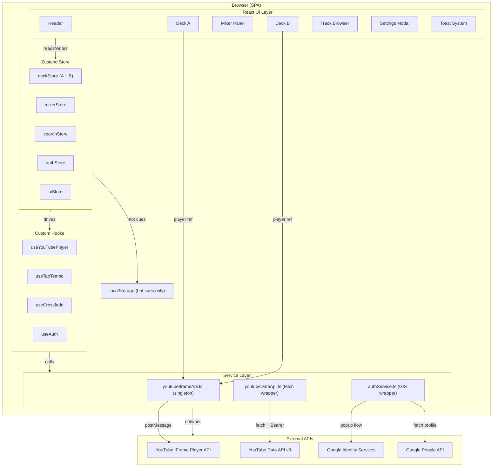

# Design Specification

> Project: `dj-rusty`
> Version: 1.0
> Date: 2026-03-21
> Phase: Planning

---

## 1. Architecture Overview

DJRusty is a browser-only single-page application (SPA). There is no backend, no server-side rendering, and no persistent storage except for localStorage used exclusively for hot cue timestamps. All OAuth tokens are stored in memory only.

### System Architecture Diagram



### Data Flow Summary

1. User authenticates via GIS popup → token stored in `authStore` (memory only)
2. Post-auth: `youtubeDataApi` fetches channel info and uploads → stored in `searchStore`
3. User searches → `youtubeDataApi.search()` → results stored in `searchStore`
4. User loads track to deck → `deckStore.loadTrack()` → `YouTubePlayer` component calls `player.cueVideoById()`
5. Crossfader moves → `useCrossfade` computes volumes → `player.setVolume()` on both players
6. Transport controls → `deckStore` actions → `useYouTubePlayer` hook calls `player.playVideo()` / `player.pauseVideo()`
7. 250ms `setInterval` while playing → `player.getCurrentTime()` → `deckStore.setCurrentTime()`

---

## 2. Project Setup

### Scaffold Command

```bash
npm create vite@latest dj-rusty -- --template react-ts
cd dj-rusty
npm install zustand
npm install --save-dev vitest @testing-library/react @testing-library/user-event @testing-library/jest-dom jsdom
```

### vite.config.ts

```typescript
import { defineConfig } from 'vite';
import react from '@vitejs/plugin-react';

export default defineConfig({
  plugins: [react()],
  test: {
    environment: 'jsdom',
    setupFiles: './src/test/setup.ts',
    globals: true,
  },
});
```

### tsconfig.json strict settings

```json
{
  "compilerOptions": {
    "strict": true,
    "noUncheckedIndexedAccess": true,
    "exactOptionalPropertyTypes": true
  }
}
```

### Environment Variables

| Variable | Purpose | Example |
|----------|---------|---------|
| `VITE_GOOGLE_CLIENT_ID` | GIS OAuth 2.0 Client ID | `123456-abc.apps.googleusercontent.com` |
| `VITE_YOUTUBE_API_KEY` | YouTube Data API v3 key (public fallback) | `AIzaSy...` |

Both variables must be present in `.env.local` for development. Neither is a secret — both are public-facing. The API key must have HTTP referrer restrictions set in Google Cloud Console before production deployment.

---

## 3. Directory Structure

```
src/
├── main.tsx                        # React DOM render, mounts <App />
├── App.tsx                         # Root layout: Header, main grid, TrackBrowser
│
├── components/
│   ├── Deck/
│   │   ├── Deck.tsx                # Deck container (deckId prop: 'A' | 'B')
│   │   ├── DeckControls.tsx        # Play/Pause, Cue, Set Cue buttons
│   │   ├── DeckDisplay.tsx         # Track title, channel, time/rate row
│   │   ├── VinylPlatter.tsx        # Circular platter, CSS spin animation
│   │   ├── PitchSlider.tsx         # input[type=range] 0–7, snaps to PITCH_RATES
│   │   ├── BpmDisplay.tsx          # <output> element showing BPM or "--"
│   │   ├── TapTempo.tsx            # TAP button + useTapTempo hook integration
│   │   ├── HotCues.tsx             # 4 hot cue buttons with localStorage state
│   │   ├── LoopControls.tsx        # 4B / 8B / 16B / EXIT buttons
│   │   ├── EQPanel.tsx             # Bass/Mid/Treble rotary knobs (visual only)
│   │   └── YouTubePlayer.tsx       # Hidden IFrame API wrapper, stores ref
│   │
│   ├── Mixer/
│   │   ├── Mixer.tsx               # Mixer column container
│   │   ├── Crossfader.tsx          # input[type=range] + useCrossfade
│   │   ├── VolumeKnob.tsx          # Per-deck gain rotary knob
│   │   └── VUMeter.tsx             # 12-segment decorative VU display
│   │
│   ├── Search/
│   │   ├── SearchPanel.tsx         # Panel shell: search bar + tabs + list
│   │   ├── SearchBar.tsx           # <form role="search"> with input + button
│   │   ├── SearchResultList.tsx    # <ul> rendering SearchResult items
│   │   └── SearchResult.tsx        # Single track row (thumb, title, load buttons)
│   │
│   ├── Auth/
│   │   ├── AuthButton.tsx          # Sign in / loading / signed-in avatar area
│   │   └── SettingsModal.tsx       # <dialog>: account info + sign out
│   │
│   ├── Layout/
│   │   ├── Header.tsx              # Logo, settings gear, auth area
│   │   └── AppLayout.tsx           # Main grid, skip link, live regions
│   │
│   └── common/
│       ├── Toast.tsx               # Individual toast notification
│       ├── ToastContainer.tsx      # Positioned container, renders uiStore.toasts
│       ├── Spinner.tsx             # CSS animated loading indicator
│       └── RotaryKnob.tsx          # Reusable knob: role=slider, drag/scroll
│
├── store/
│   ├── index.ts                    # Re-exports all stores
│   ├── deckStore.ts                # createDeckSlice(id): DeckState + actions
│   ├── mixerStore.ts               # MixerState + crossfader/volume actions
│   ├── searchStore.ts              # SearchState + search/upload actions
│   ├── authStore.ts                # AuthState + token/user/signedIn actions
│   └── uiStore.ts                  # UIState: settingsOpen, toasts[]
│
├── hooks/
│   ├── useYouTubePlayer.ts         # IFrame API lifecycle, polling, event binding
│   ├── useTapTempo.ts              # Tap timestamp ring buffer → BPM
│   ├── useCrossfade.ts             # Crossfader position → setVolume() on both players
│   ├── useAuth.ts                  # GIS init, requestAccessToken, token refresh
│   └── useKeyboardShortcuts.ts     # Global and context-scoped key bindings
│
├── services/
│   ├── youtubeIframeApi.ts         # Singleton script loader, Promise<YT>
│   ├── youtubeDataApi.ts           # search(), getVideoDetails(), getChannel(), getUploads()
│   └── authService.ts              # initTokenClient(), requestToken(), revoke()
│
├── types/
│   ├── deck.ts                     # DeckState, DeckId, PitchRate, PlaybackState
│   ├── mixer.ts                    # MixerState
│   ├── search.ts                   # YouTubeVideoSummary, SearchState
│   ├── auth.ts                     # AuthState, GoogleUserInfo, TokenResponse
│   ├── ui.ts                       # UIState, Toast, ToastType
│   └── youtube.ts                  # YT namespace claudeations (window.YT)
│
├── utils/
│   ├── pitchRates.ts               # snapToNearestRate(), rateToIndex()
│   ├── tapTempo.ts                 # calculateBPM(timestamps: number[]): number | null
│   ├── volumeMap.ts                # crossfaderToVolumes(x: number): {a: number, b: number}
│   ├── formatTime.ts               # formatSeconds(s: number): string ("mm:ss")
│   ├── isoDuration.ts              # parseISO8601Duration(s: string): number (seconds)
│   └── hotCues.ts                  # loadHotCues(videoId), saveHotCues(videoId, cues)
│
├── constants/
│   ├── pitchRates.ts               # PITCH_RATES, DEFAULT_RATE_INDEX
│   └── api.ts                      # API base URLs, quota notes
│
└── styles/
    ├── global.css                  # :root CSS custom properties, reset, .sr-only
    ├── animations.css              # @keyframes: vinyl-spin, modal-enter, toast-enter, btn-flash
    └── fonts.css                   # Google Fonts import: Rajdhani, JetBrains Mono
```

---

## 4. Type Definitions

### 4.1 `types/deck.ts`

```typescript
export type DeckId = 'A' | 'B';

export type PitchRate = 0.25 | 0.5 | 0.75 | 1 | 1.25 | 1.5 | 1.75 | 2;

export type PlaybackState =
  | 'unstarted'
  | 'playing'
  | 'paused'
  | 'ended'
  | 'buffering'
  | 'cued';

export interface HotCue {
  timestamp: number;   // seconds
  set: boolean;
}

export interface DeckState {
  deckId: DeckId;
  videoId: string | null;
  title: string;
  channelTitle: string;
  thumbnailUrl: string | null;
  duration: number;           // seconds
  currentTime: number;        // seconds, polled at 250ms
  playbackState: PlaybackState;
  pitchRate: PitchRate;
  bpm: number | null;         // user-defined via tap-tempo
  volume: number;             // 0–100 channel fader
  cuePoint: number | null;    // seconds
  hotCues: [HotCue, HotCue, HotCue, HotCue];
  loopActive: boolean;
  loopStart: number | null;   // seconds
  loopBeatCount: 4 | 8 | 16 | null;
  playerReady: boolean;
  error: string | null;
}

// Actions bundled with state in the Zustand slice
export interface DeckActions {
  loadTrack: (payload: TrackPayload) => void;
  setPlaybackState: (state: PlaybackState) => void;
  setCurrentTime: (t: number) => void;
  setDuration: (d: number) => void;
  setPlayerReady: (ready: boolean) => void;
  setPitchRate: (rate: PitchRate) => void;
  setVolume: (v: number) => void;
  setBpm: (bpm: number | null) => void;
  setCuePoint: (t: number | null) => void;
  setHotCue: (index: 0 | 1 | 2 | 3, timestamp: number | null) => void;
  setLoopActive: (active: boolean, beatCount?: 4 | 8 | 16) => void;
  setLoopStart: (t: number | null) => void;
  setError: (err: string | null) => void;
  clearDeck: () => void;
}

export interface TrackPayload {
  videoId: string;
  title: string;
  channelTitle: string;
  duration: number;
  thumbnailUrl: string;
}
```

### 4.2 `types/mixer.ts`

```typescript
export interface MixerState {
  crossfaderPosition: number;    // 0.0 (full A) – 1.0 (full B); default 0.5
  deckAComputedVolume: number;   // 0–100, result of crossfader curve
  deckBComputedVolume: number;
}

export interface MixerActions {
  setCrossfaderPosition: (x: number) => void;  // clamps to [0, 1]
  reset: () => void;
}
```

### 4.3 `types/auth.ts`

```typescript
export interface GoogleUserInfo {
  name: string;
  email: string;
  avatarUrl: string;
  channelTitle: string | null;
  subscriberCount: number | null;
}

export interface AuthState {
  accessToken: string | null;
  expiresAt: number | null;      // Unix ms timestamp
  userInfo: GoogleUserInfo | null;
  signedIn: boolean;
  loading: boolean;              // true while OAuth popup in progress
  error: string | null;
}

export interface AuthActions {
  setAccessToken: (token: string, expiresIn: number) => void;
  setUserInfo: (info: GoogleUserInfo) => void;
  setSignedIn: (v: boolean) => void;
  setLoading: (v: boolean) => void;
  setError: (err: string | null) => void;
  clear: () => void;
}
```

### 4.4 `types/search.ts`

```typescript
export interface YouTubeVideoSummary {
  videoId: string;
  title: string;
  channelTitle: string;
  thumbnailUrl: string;
  duration: number;             // seconds, parsed from ISO 8601
  publishedAt?: string;         // ISO date string
}

export type BrowserTab = 'uploads' | 'search';

export interface SearchState {
  query: string;
  results: YouTubeVideoSummary[];
  uploads: YouTubeVideoSummary[];
  nextPageToken: string | null;
  prevPageToken: string | null;
  activeTab: BrowserTab;
  loading: boolean;
  error: string | null;
}

export interface SearchActions {
  setQuery: (q: string) => void;
  setResults: (results: YouTubeVideoSummary[], nextToken: string | null, prevToken: string | null) => void;
  setUploads: (uploads: YouTubeVideoSummary[]) => void;
  setActiveTab: (tab: BrowserTab) => void;
  setLoading: (v: boolean) => void;
  setError: (err: string | null) => void;
  clear: () => void;
}
```

### 4.5 `types/ui.ts`

```typescript
export type ToastType = 'error' | 'warning' | 'success' | 'info';

export interface Toast {
  id: string;
  type: ToastType;
  message: string;
  autoDismissMs: number;   // default 5000
}

export interface UIState {
  settingsOpen: boolean;
  toasts: Toast[];
}

export interface UIActions {
  openSettings: () => void;
  closeSettings: () => void;
  addToast: (type: ToastType, message: string, autoDismissMs?: number) => void;
  removeToast: (id: string) => void;
}
```

### 4.6 `types/youtube.ts`

```typescript
// Augment the global YT namespace injected by the IFrame API script
declare global {
  interface Window {
    YT: typeof YT;
    onYouTubeIframeAPIReady: (() => void) | undefined;
  }

  namespace YT {
    enum PlayerState {
      UNSTARTED = -1,
      ENDED = 0,
      PLAYING = 1,
      PAUSED = 2,
      BUFFERING = 3,
      CUED = 5,
    }

    interface PlayerOptions {
      height?: string | number;
      width?: string | number;
      videoId?: string;
      playerVars?: Record<string, unknown>;
      events?: {
        onReady?: (event: PlayerEvent) => void;
        onStateChange?: (event: OnStateChangeEvent) => void;
        onError?: (event: OnErrorEvent) => void;
        onPlaybackRateChange?: (event: OnPlaybackRateChangeEvent) => void;
      };
    }

    interface PlayerEvent {
      target: Player;
    }

    interface OnStateChangeEvent extends PlayerEvent {
      data: PlayerState;
    }

    interface OnErrorEvent extends PlayerEvent {
      data: number;
    }

    interface OnPlaybackRateChangeEvent extends PlayerEvent {
      data: number;
    }

    class Player {
      constructor(elementId: string, options: PlayerOptions);
      playVideo(): void;
      pauseVideo(): void;
      stopVideo(): void;
      seekTo(seconds: number, allowSeekAhead: boolean): void;
      setVolume(volume: number): void;
      getVolume(): number;
      mute(): void;
      unMute(): void;
      isMuted(): boolean;
      setPlaybackRate(rate: number): void;
      getPlaybackRate(): number;
      getAvailablePlaybackRates(): number[];
      getCurrentTime(): number;
      getDuration(): number;
      getVideoLoadedFraction(): number;
      cueVideoById(videoId: string): void;
      loadVideoById(videoId: string): void;
      destroy(): void;
      getIframe(): HTMLIFrameElement;
    }
  }
}

export {};
```

---

## 5. Zustand Store Slice Designs

### 5.1 `store/deckStore.ts`

```typescript
import { create } from 'zustand';
import { DeckState, DeckActions, DeckId, TrackPayload } from '../types/deck';

const DEFAULT_HOT_CUES = [
  { timestamp: 0, set: false },
  { timestamp: 0, set: false },
  { timestamp: 0, set: false },
  { timestamp: 0, set: false },
] as [HotCue, HotCue, HotCue, HotCue];

const createInitialState = (deckId: DeckId): DeckState => ({
  deckId,
  videoId: null,
  title: '',
  channelTitle: '',
  thumbnailUrl: null,
  duration: 0,
  currentTime: 0,
  playbackState: 'unstarted',
  pitchRate: 1,
  bpm: null,
  volume: 80,
  cuePoint: null,
  hotCues: structuredClone(DEFAULT_HOT_CUES),
  loopActive: false,
  loopStart: null,
  loopBeatCount: null,
  playerReady: false,
  error: null,
});

// Two independent stores — one per deck
export const useDeckAStore = create<DeckState & DeckActions>()((set) => ({
  ...createInitialState('A'),
  loadTrack: (payload: TrackPayload) =>
    set({
      videoId: payload.videoId,
      title: payload.title,
      channelTitle: payload.channelTitle,
      thumbnailUrl: payload.thumbnailUrl,
      duration: payload.duration,
      currentTime: 0,
      playbackState: 'unstarted',
      cuePoint: null,
      loopActive: false,
      loopStart: null,
      loopBeatCount: null,
      error: null,
    }),
  setPlaybackState: (state) => set({ playbackState: state }),
  setCurrentTime: (t) => set({ currentTime: t }),
  setDuration: (d) => set({ duration: d }),
  setPlayerReady: (ready) => set({ playerReady: ready }),
  setPitchRate: (rate) => set({ pitchRate: rate }),
  setVolume: (v) => set({ volume: Math.max(0, Math.min(100, v)) }),
  setBpm: (bpm) => set({ bpm }),
  setCuePoint: (t) => set({ cuePoint: t }),
  setHotCue: (index, timestamp) =>
    set((s) => {
      const cues = [...s.hotCues] as typeof s.hotCues;
      cues[index] = { timestamp: timestamp ?? 0, set: timestamp !== null };
      return { hotCues: cues };
    }),
  setLoopActive: (active, beatCount) =>
    set({ loopActive: active, loopBeatCount: beatCount ?? null }),
  setLoopStart: (t) => set({ loopStart: t }),
  setError: (err) => set({ error: err }),
  clearDeck: () => set(createInitialState('A')),
}));

// useDeckBStore: identical factory, deckId = 'B', clearDeck resets to 'B' initial state
export const useDeckBStore = create<DeckState & DeckActions>()((set) => ({
  ...createInitialState('B'),
  // ... same actions, clearDeck resets to createInitialState('B')
}));
```

### 5.2 `store/mixerStore.ts`

```typescript
// crossfaderPosition stored as 0.0–1.0
// crossfader UI slider 0–100 → divide by 100 before storing
// deckAComputedVolume and deckBComputedVolume are derived, recomputed on every position change
// Caller must apply channel fader multiplicatively before calling player.setVolume()
export const useMixerStore = create<MixerState & MixerActions>()((set) => ({
  crossfaderPosition: 0.5,
  deckAComputedVolume: 71,   // cos(0.5 * π/2) * 100 ≈ 71
  deckBComputedVolume: 71,
  setCrossfaderPosition: (x: number) => {
    const clamped = Math.max(0, Math.min(1, x));
    const a = Math.round(Math.cos(clamped * Math.PI / 2) * 100);
    const b = Math.round(Math.cos((1 - clamped) * Math.PI / 2) * 100);
    set({ crossfaderPosition: clamped, deckAComputedVolume: a, deckBComputedVolume: b });
  },
  reset: () => set({ crossfaderPosition: 0.5, deckAComputedVolume: 71, deckBComputedVolume: 71 }),
}));
```

### 5.3 `store/authStore.ts`

```typescript
export const useAuthStore = create<AuthState & AuthActions>()((set) => ({
  accessToken: null,
  expiresAt: null,
  userInfo: null,
  signedIn: false,
  loading: false,
  error: null,
  setAccessToken: (token, expiresIn) =>
    set({ accessToken: token, expiresAt: Date.now() + expiresIn * 1000 }),
  setUserInfo: (info) => set({ userInfo: info }),
  setSignedIn: (v) => set({ signedIn: v }),
  setLoading: (v) => set({ loading: v }),
  setError: (err) => set({ error: err }),
  clear: () =>
    set({ accessToken: null, expiresAt: null, userInfo: null, signedIn: false, loading: false, error: null }),
}));
```

### 5.4 `store/searchStore.ts`

```typescript
export const useSearchStore = create<SearchState & SearchActions>()((set) => ({
  query: '',
  results: [],
  uploads: [],
  nextPageToken: null,
  prevPageToken: null,
  activeTab: 'uploads',
  loading: false,
  error: null,
  setQuery: (q) => set({ query: q }),
  setResults: (results, nextToken, prevToken) =>
    set({ results, nextPageToken: nextToken, prevPageToken: prevToken }),
  setUploads: (uploads) => set({ uploads }),
  setActiveTab: (tab) => set({ activeTab: tab }),
  setLoading: (v) => set({ loading: v }),
  setError: (err) => set({ error: err }),
  clear: () =>
    set({ results: [], uploads: [], nextPageToken: null, prevPageToken: null, error: null }),
}));
```

### 5.5 `store/uiStore.ts`

```typescript
import { nanoid } from 'nanoid'; // or use crypto.randomUUID()
export const useUIStore = create<UIState & UIActions>()((set) => ({
  settingsOpen: false,
  toasts: [],
  openSettings: () => set({ settingsOpen: true }),
  closeSettings: () => set({ settingsOpen: false }),
  addToast: (type, message, autoDismissMs = 5000) =>
    set((s) => ({ toasts: [...s.toasts, { id: crypto.randomUUID(), type, message, autoDismissMs }] })),
  removeToast: (id) =>
    set((s) => ({ toasts: s.toasts.filter((t) => t.id !== id) })),
}));
```

---

## 6. Service Layer Designs

### 6.1 `services/youtubeIframeApi.ts`

Singleton pattern: injects the IFrame API script once and resolves a Promise when `window.YT.Player` is ready.

```typescript
// Key contract:
let _ready: Promise<void>;

export function getYTApiReady(): Promise<void> {
  if (_ready) return _ready;
  _ready = new Promise((resolve) => {
    if (window.YT?.Player) { resolve(); return; }
    const prev = window.onYouTubeIframeAPIReady;
    window.onYouTubeIframeAPIReady = () => {
      prev?.();
      resolve();
    };
    const script = document.createElement('script');
    script.src = 'https://www.youtube.com/iframe_api';
    document.head.appendChild(script);
  });
  return _ready;
}

// Factory for creating a player on a given DOM element ID
export function createPlayer(
  elementId: string,
  options: YT.PlayerOptions
): Promise<YT.Player> {
  return getYTApiReady().then(
    () => new Promise((resolve) => {
      const player = new window.YT.Player(elementId, {
        ...options,
        events: {
          ...options.events,
          onReady: (e) => {
            options.events?.onReady?.(e);
            resolve(player);
          },
        },
      });
    })
  );
}
```

**Critical notes:**
- `window.onYouTubeIframeAPIReady` must be set BEFORE injecting the script.
- The safe append pattern (`prev?.()`) preserves any existing callback.
- Never call `new YT.Player()` before `getYTApiReady()` resolves.
- The API script must be injected only once; subsequent calls return the same promise.

### 6.2 `services/youtubeDataApi.ts`

```typescript
// All methods accept accessToken. Throws typed errors for quota, forbidden, not-found.

interface ApiError {
  code: number;       // HTTP status
  reason: string;     // 'quotaExceeded' | 'keyInvalid' | 'forbidden' | etc.
  message: string;
}

// Two-step search: search.list → videos.list (batch)
export async function searchVideos(
  query: string,
  accessToken: string,
  pageToken?: string
): Promise<{ results: YouTubeVideoSummary[]; nextPageToken: string | null }>;

// Fetch full details for a set of video IDs (used to get duration)
export async function getVideoDetails(
  videoIds: string[],
  accessToken: string
): Promise<YouTubeVideoSummary[]>;

// Fetch authenticated user's channel info
export async function getChannelInfo(
  accessToken: string
): Promise<{ channelId: string; channelTitle: string; uploadsPlaylistId: string; subscriberCount: number }>;

// Fetch uploads playlist items
export async function getUploads(
  uploadsPlaylistId: string,
  accessToken: string,
  pageToken?: string
): Promise<{ uploads: YouTubeVideoSummary[]; nextPageToken: string | null }>;
```

**Two-step search implementation:**
1. `GET /youtube/v3/search?part=snippet&q={query}&type=video&maxResults=20&pageToken={token}` (100 units)
2. Extract all `videoId` values from results
3. `GET /youtube/v3/videos?part=snippet,contentDetails&id={id1,id2,...}` (1 unit)
4. Merge: use `snippet.title`, `snippet.channelTitle`, `snippet.thumbnails.medium.url` from videos response; parse `contentDetails.duration` with `parseISO8601Duration`

**ISO 8601 Duration parsing (`utils/isoduration.ts`):**
```
PT3M45S → 225 seconds
PT1H2M3S → 3723 seconds
Regex: /PT(?:(\d+)H)?(?:(\d+)M)?(?:(\d+)S)?/
```

### 6.3 `services/authService.ts`

```typescript
let tokenClient: google.accounts.oauth2.TokenClient | null = null;

export function initGIS(): void {
  // Loads the GIS script if not already present, sets up tokenClient
  // Called once in App.tsx useEffect
}

export function requestAccessToken(prompt: '' | 'consent'): void {
  // Calls tokenClient.requestAccessToken({ prompt })
  // The callback is wired to the authStore in useAuth hook
}

export function revokeToken(token: string): Promise<void>;

// Token refresh check: call before each API request
export function isTokenExpired(expiresAt: number | null): boolean {
  if (!expiresAt) return true;
  return Date.now() > expiresAt - 120_000; // 2 min buffer
}
```

---

## 7. Custom Hooks

### 7.1 `hooks/useYouTubePlayer.ts`

```typescript
interface UseYouTubePlayerOptions {
  deckId: DeckId;
  elementId: string;        // DOM ID for the iframe container
}

// Returns: { playerRef: React.MutableRefObject<YT.Player | null> }
// Responsibilities:
// 1. On mount: calls createPlayer(elementId, {...}) after getYTApiReady()
// 2. Binds onReady → deckStore.setPlayerReady(true)
// 3. Binds onStateChange → maps YT.PlayerState → PlaybackState → deckStore.setPlaybackState()
// 4. Binds onError → parses error codes 101/150 (unembeddable) → deckStore.setError() + uiStore.addToast()
// 5. Binds onPlaybackRateChange → deckStore.setPitchRate()
// 6. Watches deckStore.videoId: if changed, calls player.cueVideoById(videoId)
// 7. Watches deckStore.pitchRate: calls player.setPlaybackRate(rate)
// 8. Starts/stops 250ms polling interval when playbackState === 'playing'
//    Polling: deckStore.setCurrentTime(player.getCurrentTime())
//             If loopActive: check if currentTime >= loopStart + loopDuration → seekTo(loopStart)
// 9. On unmount: clears interval, calls player.destroy()
// 10. Autoplay muted init: first load calls player.mute() to allow autoplay, then unMute() on first play
```

**Loop check in polling interval:**
```
loopDuration = (loopBeatCount / bpm) * 60  // seconds
if (currentTime >= loopStart + loopDuration) {
  player.seekTo(loopStart, true);
}
```

**Volume composition (applied on every render where volume or crossfader changes):**
```
finalVolume = crossfaderComputedVolume * (deckVolume / 100)
finalVolume = Math.round(Math.max(0, Math.min(100, finalVolume)))
player.setVolume(finalVolume)
```

### 7.2 `hooks/useTapTempo.ts`

```typescript
// Returns: { bpm: number | null, tap: () => void, reset: () => void }
// State: taps[] = ring buffer of last 4 tap timestamps (Date.now())
// Algorithm:
//   On tap():
//     const now = Date.now();
//     If last tap was > 3000ms ago, clear taps[] and start fresh
//     Push now to taps[]
//     Keep only last 4 entries
//     If taps.length >= 2: calculate BPM = 60000 / avg(consecutive intervals)
//     Update bpm state
//   Reset: clear taps[], set bpm = null
// Must call deckStore.setBpm(bpm) when BPM changes
```

### 7.3 `hooks/useCrossfade.ts`

```typescript
// Subscribes to mixerStore.crossfaderPosition + deckAStore.volume + deckBStore.volume
// On any change, computes final volumes and calls setVolume() on both players
// Players accessed via refs passed in, or via a shared player registry
// Throttle: apply setVolume at most every 16ms (one rAF frame) to avoid API overload
```

### 7.4 `hooks/useAuth.ts`

```typescript
// Responsibilities:
// 1. On mount: inject GIS script tag if not present, wait for window.google to be available
// 2. Initialize tokenClient via authService.initGIS()
// 3. Attempt silent token request (prompt: '')
// 4. Wire token callback → authStore.setAccessToken() + post-auth data fetching
// 5. Expose: signIn(), signOut()
// 6. signIn(): authStore.setLoading(true) → requestAccessToken('consent')
// 7. signOut(): call revokeToken() → clear all stores → call deckA/B player.stopVideo()
// 8. Handle token expiry: intercept 401 responses in youtubeDataApi → silent refresh
```

### 7.5 `hooks/useKeyboardShortcuts.ts`

```typescript
// Attaches keydown listener to document
// Guards: Space/Enter preventDefault only when NOT in input/textarea/button
// Global shortcuts (always active):
//   ← → : mixerStore.setCrossfaderPosition(current ± 0.05)
//   q : deckAStore.setCuePoint + seek
//   w : deckAStore seek to cuePoint
//   o : deckBStore.setCuePoint + seek
//   p : deckBStore seek to cuePoint
//   t : deckA tap BPM
//   y : deckB tap BPM
//   / : focus #search-input, preventDefault
//   Escape : uiStore.closeSettings()
// Context shortcuts (check document.activeElement is within Deck A/B section):
//   Space in Deck A context: toggle play/pause Deck A
//   Enter in Deck B context: toggle play/pause Deck B
//   1–4 in focused deck context: hot cue jump
```

---

## 8. Component Prop Interfaces

### 8.1 Deck Components

```typescript
// Deck.tsx
interface DeckProps {
  deckId: DeckId;
}

// VinylPlatter.tsx
interface VinylPlatterProps {
  isPlaying: boolean;
  pitchRate: PitchRate;
  thumbnailUrl: string | null;
  // aria-hidden="true" — decorative
}

// DeckControls.tsx
interface DeckControlsProps {
  deckId: DeckId;
  isPlaying: boolean;
  videoId: string | null;
  cuePoint: number | null;
  onPlayPause: () => void;
  onSetCue: () => void;
  onJumpToCue: () => void;
}

// DeckDisplay.tsx
interface DeckDisplayProps {
  deckId: DeckId;
  title: string;
  channelTitle: string;
  currentTime: number;
  duration: number;
  pitchRate: PitchRate;
  bpm: number | null;
}

// PitchSlider.tsx
interface PitchSliderProps {
  deckId: DeckId;
  value: PitchRate;
  onChange: (rate: PitchRate) => void;
}

// TapTempo.tsx
interface TapTempoProps {
  deckId: DeckId;
  bpm: number | null;
  onTap: () => void;
  // Renders TAP button + BpmDisplay
}

// HotCues.tsx
interface HotCuesProps {
  deckId: DeckId;
  hotCues: [HotCue, HotCue, HotCue, HotCue];
  onSet: (index: 0 | 1 | 2 | 3) => void;
  onJump: (index: 0 | 1 | 2 | 3) => void;
  onClear: (index: 0 | 1 | 2 | 3) => void;
}

// LoopControls.tsx
interface LoopControlsProps {
  deckId: DeckId;
  bpm: number | null;
  loopActive: boolean;
  loopBeatCount: 4 | 8 | 16 | null;
  onActivateLoop: (beatCount: 4 | 8 | 16) => void;
  onExitLoop: () => void;
}

// EQPanel.tsx
interface EQPanelProps {
  deckId: DeckId;
  // v1: visual only — stores knob angles in local state
  // Does NOT connect to any audio API
}

// YouTubePlayer.tsx
interface YouTubePlayerProps {
  deckId: DeckId;
  elementId: string;     // 'yt-player-a' | 'yt-player-b'
}
```

### 8.2 Mixer Components

```typescript
// Mixer.tsx — no props, reads from stores directly

// Crossfader.tsx
interface CrossfaderProps {
  value: number;              // 0–100 (UI representation)
  onChange: (value: number) => void;
}

// VolumeKnob.tsx
interface VolumeKnobProps {
  deckId: DeckId;
  value: number;              // 0–100
  onChange: (value: number) => void;
}

// VUMeter.tsx
interface VUMeterProps {
  deckId: DeckId;
  isPlaying: boolean;
  // aria-hidden="true"
}
```

### 8.3 Search Components

```typescript
// SearchPanel.tsx — no props, reads from stores

// SearchBar.tsx
interface SearchBarProps {
  query: string;
  loading: boolean;
  disabled: boolean;
  onSearch: (query: string) => void;
}

// SearchResult.tsx
interface SearchResultProps {
  video: YouTubeVideoSummary;
  onLoadToDeck: (deckId: DeckId) => void;
}
```

### 8.4 Auth Components

```typescript
// AuthButton.tsx — no props, reads from authStore

// SettingsModal.tsx
interface SettingsModalProps {
  isOpen: boolean;
  onClose: () => void;
  triggerRef: React.RefObject<HTMLElement>;  // for focus return
}
```

### 8.5 Common Components

```typescript
// RotaryKnob.tsx
interface RotaryKnobProps {
  label: string;
  value: number;            // −100 to 100, normalized
  onChange: (v: number) => void;
  disabled?: boolean;
  size?: 'sm' | 'md';       // 40px or 48px
  disabledTooltip?: string;
}

// Toast.tsx
interface ToastProps {
  toast: Toast;
  onDismiss: (id: string) => void;
}
```

---

## 9. CSS Custom Properties (Design Tokens)

The full token set lives in `src/styles/global.css` under `:root`. Key tokens:

```css
:root {
  /* Backgrounds */
  --color-bg-base: #0a0a0a;
  --color-bg-surface: #111111;
  --color-bg-elevated: #1a1a1a;
  --color-bg-overlay: #222222;
  --color-bg-modal: #1a1a1a;
  --color-bg-modal-backdrop: rgba(0, 0, 0, 0.75);

  /* Borders */
  --color-border-subtle: #1a1a1a;
  --color-border-default: #2a2a2a;
  --color-border-muted: #333333;
  --color-border-strong: #444444;

  /* Text */
  --color-text-primary: #e0e0e0;
  --color-text-secondary: #aaaaaa;
  --color-text-muted: #888888;
  --color-text-disabled: #444444;
  --color-text-inverse: #000000;

  /* Brand Accent */
  --color-accent-primary: #ff6b00;
  --color-accent-primary-dim: rgba(255, 107, 0, 0.15);
  --color-accent-primary-bright: #ff8c33;

  /* Deck A (blue) */
  --color-deck-a-bg: #1a3a5c;
  --color-deck-a-border: #2a6aaa;
  --color-deck-a-text: #7ab8f5;

  /* Deck B (red) */
  --color-deck-b-bg: #3a1a1a;
  --color-deck-b-border: #aa3a3a;
  --color-deck-b-text: #f57a7a;

  /* State */
  --color-state-success: #27ae60;
  --color-state-success-dim: #1a3a1a;
  --color-state-success-border: #4a9a4a;
  --color-state-success-text: #7fd97f;
  --color-state-warning: #f39c12;
  --color-state-error: #c0392b;
  --color-state-info: #2980b9;

  /* Typography */
  --font-primary: 'Rajdhani', 'Orbitron', system-ui, sans-serif;
  --font-mono: 'JetBrains Mono', 'Fira Code', 'Consolas', monospace;
  --text-xs: 10px;
  --text-sm: 11px;
  --text-base: 13px;
  --text-md: 14px;
  --text-lg: 16px;
  --text-xl: 20px;
  --tracking-wide: 0.08em;
  --tracking-widest: 0.15em;

  /* Spacing (8px grid) */
  --space-1: 4px;
  --space-2: 8px;
  --space-3: 12px;
  --space-4: 16px;
  --space-5: 20px;
  --space-6: 24px;
  --space-8: 32px;
  --space-10: 40px;

  /* Border Radius */
  --radius-sm: 2px;
  --radius-md: 4px;
  --radius-lg: 6px;
  --radius-full: 50%;

  /* Shadows */
  --shadow-sm: 0 1px 3px rgba(0,0,0,0.5);
  --shadow-md: 0 4px 12px rgba(0,0,0,0.6);
  --shadow-platter: 0 0 16px rgba(0,0,0,0.8), inset 0 0 8px rgba(0,0,0,0.6);
  --shadow-button-active: 0 0 8px rgba(255,107,0,0.4);
  --shadow-focus: 0 0 0 2px rgba(255,107,0,0.25);
  --shadow-knob: 0 2px 4px rgba(0,0,0,0.8), inset 0 1px 1px rgba(255,255,255,0.05);

  /* Transitions */
  --transition-fast: 120ms ease;
  --transition-base: 150ms ease;
  --transition-slow: 300ms ease;

  /* Vinyl */
  --spin-duration: 1.8s;
  --spin-state: paused;

  /* Buttons */
  --btn-height-sm: 28px;
  --btn-height-md: 36px;
  --btn-height-lg: 44px;
}
```

Animations in `src/styles/animations.css`:

```css
@keyframes vinyl-spin {
  from { transform: rotate(0deg); }
  to   { transform: rotate(360deg); }
}

@keyframes modal-enter {
  from { opacity: 0; transform: scale(0.95); }
  to   { opacity: 1; transform: scale(1); }
}

@keyframes toast-enter {
  from { opacity: 0; transform: translateY(-8px); }
  to   { opacity: 1; transform: translateY(0); }
}

@keyframes btn-flash {
  0%   { background: #ff6b00; }
  100% { background: #1e1e1e; }
}

@media (prefers-reduced-motion: reduce) {
  .platter {
    animation-play-state: paused !important;
  }
  *, *::before, *::after {
    transition-duration: 0.01ms !important;
    animation-duration: 0.01ms !important;
    animation-iteration-count: 1 !important;
  }
}
```

---

## 10. Technical Decisions

| Decision | Rationale | Trade-off |
|----------|-----------|-----------|
| Two Zustand stores for decks (`useDeckAStore`, `useDeckBStore`) rather than a single store keyed by ID | Simpler TypeScript types; no dynamic store key lookup; no risk of cross-deck mutation | Slight code duplication in store definition; mitigated by shared factory function |
| `YT.Player` instances stored in `useRef`, not Zustand | Players are imperative objects, not serialisable state; Zustand would break time-travel and clone attempts | Must pass refs down via context or a global player registry |
| Player instance access via module-level registry (`{ A: YT.Player, B: YT.Player }`) | `useCrossfade` and `useKeyboardShortcuts` need access to players without prop drilling | Imperative coupling; acceptable given app's single-page nature |
| Crossfader stores position as `0.0–1.0` float; slider input as `0–100` int | Cleaner math (π/2 curve); avoids integer division artifacts | Conversion needed at slider boundary |
| CSS Modules for component styles | Zero runtime, component-scoped; pairs with global CSS custom properties for theme | Cannot use dynamic class composition without `clsx` helper |
| `input[type=range]` for all sliders | Native keyboard support (arrows, Home/End); ARIA built-in | Custom thumb styling requires vendor-prefixed pseudo-elements (`-webkit-slider-thumb`) |
| `<dialog>` element for Settings Modal | Native focus trapping, backdrop, Escape handling in modern browsers | Requires polyfill or fallback for Safari < 15.4 (though 15.4+ covers target browsers) |

---

## 11. Security Specifications

| Area | Implementation |
|------|----------------|
| OAuth token storage | In-memory only (`authStore.accessToken`). Never written to `localStorage`, `sessionStorage`, `IndexedDB`, or cookies. Token is lost on page refresh — deliberate. |
| API key exposure | `VITE_YOUTUBE_API_KEY` is a public-facing key. Mitigated by HTTP referrer restriction in Google Cloud Console. Scope is `youtube.readonly` — read-only. |
| XSS | Standard React JSX escaping. No `dangerouslySetInnerHTML` used. Token in memory cannot be stolen across sessions. |
| CORS | YouTube IFrame audio cannot be captured (cross-origin sandbox). This is a constraint, not a risk. |
| YouTube ToS | IFrame players must remain in the DOM and visible to the browser (not `display:none`). Use `<details>` wrapper collapsed by default or small opacity strip at bottom of deck. |
| Token revocation | `google.accounts.oauth2.revoke()` called on sign-out. |
| Input sanitisation | Search queries passed as URL query parameters via `fetch` — no server-side injection risk. React encodes all rendered values. |

---

## 12. Performance Specifications

| Concern | Target | Implementation |
|---------|--------|----------------|
| Initial load | < 3s on broadband | Vite code splitting; GIS and YouTube IFrame scripts loaded async |
| Crossfader latency | < 50ms to volume change | `onInput` handler (not `onChange`) for real-time response; `setVolume()` called inline |
| `getCurrentTime` polling | 250ms | `setInterval` active only while `playbackState === 'playing'` |
| Crossfader `setVolume` throttle | 16ms minimum | `requestAnimationFrame` gate or leading-edge throttle |
| Search debounce | User-initiated only | No debounce on search — 100 quota units per call is too expensive for auto-search |
| Vinyl animation | 60fps CSS | `will-change: transform` on `.platter`; `animation-play-state` toggle (no JS position calc) |
| Re-render isolation | Fine-grained | Zustand subscriptions per field; `React.memo` on `VinylPlatter`, `VUMeter`, `SearchResult` |
| Bundle size | Minimal | No heavy dependencies; YouTube IFrame API loaded from CDN; no icon library (Unicode + Heroicons SVG inline) |
