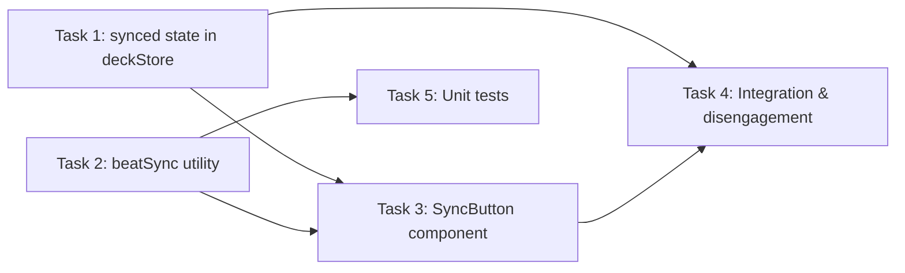

# STORY-DJ-001: Beat Sync

**Status**: Ready for Development
**Complexity**: Medium
**Estimated Tasks**: 5
**Dependencies**: None (builds on existing deckStore, PitchSlider, TapTempo infrastructure)

---

## Objective

Add a SYNC button to each deck that snaps the deck's playback rate to the closest available `PITCH_RATES` value such that the deck's effective BPM matches the other deck's tapped BPM. The button shows a lit LED when synced and automatically disengages when the user manually changes pitch or the other deck's BPM changes.

---

## Scope

**In scope:**
- Pure utility functions for beat-sync ratio calculation (`src/utils/beatSync.ts`)
- `synced` boolean field added to `DeckState` and `deckStore`
- `setSynced` action added to `deckStore`
- `SyncButton` component with LED indicator and disabled state
- Integration of `SyncButton` into `DeckControls`
- Sync disengagement on manual pitch change (PitchSlider)
- Sync disengagement on other deck's BPM change (TapTempo / setBpm)
- Unit tests for the pure beat-sync utility functions

**Out of scope:**
- Phase-alignment or beat-grid synchronisation (only BPM rate matching)
- Auto-sync on track load (sync is user-initiated only)
- Keyboard shortcut for SYNC (can be added in a future story)
- Changes to `useYouTubePlayer.ts` (the existing pitchRate subscription already applies rate changes to the player)

---

## Acceptance Criteria

- [ ] **AC-1: SYNC button visible.** Each deck displays a SYNC button within the `DeckControls` area, positioned after the existing transport buttons.
- [ ] **AC-2: Pressing SYNC snaps pitch rate.** When pressed, the deck's `pitchRate` is set to the `PITCH_RATES` value closest to `otherDeck.bpm / thisDeck.bpm`. The existing `useYouTubePlayer` pitchRate subscription applies the rate change to the YouTube player automatically.
- [ ] **AC-3: SYNC disabled when BPM missing.** The SYNC button is disabled (greyed out, `cursor: not-allowed`) when either deck has `bpm === null` or `bpm === 0`. The button's `disabled` HTML attribute is set.
- [ ] **AC-4: SYNC LED lit when synced.** When `synced === true` for a deck, the SYNC button displays a lit accent-color visual indicator (matching the project's `--color-accent-primary` design token).
- [ ] **AC-5: SYNC disengages on manual pitch change.** When the user moves the pitch slider (PitchSlider `handleChange`) or clicks the reset button (PitchSlider `handleReset`), `setSynced(deckId, false)` is called, turning off the LED.
- [ ] **AC-6: SYNC disengages when other deck's BPM changes.** When `setBpm` is called for deck X, `setSynced` is called with `false` for the opposite deck (Y), because the BPM that deck Y synced to is no longer valid.
- [ ] **AC-7: SYNC is a no-op when BPMs match.** If both decks already have the same BPM, pressing SYNC still sets the rate to 1.0 (or the closest `PITCH_RATES` value to a ratio of 1.0) and marks the deck as synced. The button is not disabled in this case.
- [ ] **AC-8: Works independently for both decks.** Deck A can sync to Deck B and Deck B can sync to Deck A simultaneously. Each deck's `synced` state is independent.
- [ ] **AC-9: SYNC resets on track load/clear.** When `loadTrack` or `clearTrack` is called for a deck, `synced` resets to `false` for that deck.

---

## Technical Specification

### Task 1: Add `synced` State to Deck Store

**Sizing**: Small
**Complexity**: Low
**Dependencies**: None

**Description**: Add a `synced: boolean` field to `DeckState` and a `setSynced` action to the deck store. Ensure `synced` resets to `false` on `loadTrack` and `clearTrack`.

**Implementation Steps:**

1. In `src/types/deck.ts`, add to the `DeckState` interface:
   ```typescript
   /** Whether this deck's pitch rate is currently beat-synced to the other deck. */
   synced: boolean;
   ```

2. In `src/store/deckStore.ts`, update `createInitialDeckState` to include `synced: false`.

3. In `src/store/deckStore.ts`, add to `DeckStoreActions`:
   ```typescript
   /** Set the synced state for the specified deck. */
   setSynced: (deckId: 'A' | 'B', synced: boolean) => void;
   ```

4. In `src/store/deckStore.ts`, implement the `setSynced` action:
   ```typescript
   setSynced: (deckId, synced) => {
     updateDeck(set, deckId, { synced });
   },
   ```

5. In the `loadTrack` action, add `synced: false` to the updates object (line ~141).

6. In the `clearTrack` action, add `synced: false` to the updates object (line ~246).

**Files to modify:**
- `src/types/deck.ts` -- add `synced: boolean` to `DeckState`
- `src/store/deckStore.ts` -- add `synced` to initial state, add `setSynced` action, reset in `loadTrack`/`clearTrack`

**Testing Requirements:**
- Verify `synced` defaults to `false` in initial deck state
- Verify `setSynced` updates the correct deck
- Verify `loadTrack` resets `synced` to `false`
- Verify `clearTrack` resets `synced` to `false`

**Acceptance Criteria:**
- [ ] `synced: boolean` exists on `DeckState`
- [ ] `setSynced` action exists and updates state correctly
- [ ] `loadTrack` and `clearTrack` reset `synced` to `false`

---

### Task 2: Create Beat Sync Utility

**Sizing**: Small
**Complexity**: Low
**Dependencies**: None (pure functions, no store dependency)

**Description**: Create a pure utility module with two functions for calculating beat-sync pitch rates.

**File to create:** `src/utils/beatSync.ts`

**Implementation Steps:**

1. Create `src/utils/beatSync.ts` with the following exports:

```typescript
import { PITCH_RATES, type PitchRate } from '../constants/pitchRates';

/**
 * Find the PITCH_RATES value closest to the given ratio.
 *
 * @param ratio - The target playback rate ratio (targetBPM / sourceBPM).
 * @param pitchRates - The array of allowed discrete pitch rates.
 * @returns The closest PitchRate value.
 */
export function findClosestPitchRate(
  ratio: number,
  pitchRates: readonly number[] = PITCH_RATES,
): PitchRate {
  let closest = pitchRates[0];
  let minDiff = Math.abs(ratio - closest);

  for (let i = 1; i < pitchRates.length; i++) {
    const diff = Math.abs(ratio - pitchRates[i]);
    if (diff < minDiff) {
      minDiff = diff;
      closest = pitchRates[i];
    }
  }

  return closest as PitchRate;
}

/**
 * Calculate the pitch rate needed to sync thisDeck's BPM to otherDeck's BPM.
 *
 * @param thisBpm - The tapped BPM of the deck being synced (the deck the user clicked SYNC on).
 * @param otherBpm - The tapped BPM of the other deck (the target BPM).
 * @param pitchRates - The array of allowed discrete pitch rates.
 * @returns The closest PitchRate, or null if either BPM is falsy (null, 0, undefined).
 */
export function calculateSyncRate(
  thisBpm: number | null,
  otherBpm: number | null,
  pitchRates: readonly number[] = PITCH_RATES,
): PitchRate | null {
  if (!thisBpm || !otherBpm) return null;

  const ratio = otherBpm / thisBpm;
  return findClosestPitchRate(ratio, pitchRates);
}
```

**Key design decisions:**
- Both functions accept `pitchRates` as a parameter (defaulting to `PITCH_RATES`) for testability.
- `calculateSyncRate` returns `null` when either BPM is falsy (0, null, undefined) -- this maps directly to the disabled state of the SYNC button.
- `findClosestPitchRate` uses a simple linear scan (8 elements, no need for binary search).
- The `nearestPitchRate` function already exists in `pitchRates.ts` but it does not accept a custom ratio target -- it finds the rate closest to a given value. `findClosestPitchRate` serves the same purpose but is explicitly named for the beat-sync context and accepts the rates array for testing. The developer MAY choose to reuse `nearestPitchRate` directly if preferred -- the key requirement is the `calculateSyncRate` function that computes the ratio first.

**Files to create:**
- `src/utils/beatSync.ts`

**Testing Requirements:**
- `findClosestPitchRate(1.0, PITCH_RATES)` returns `1`
- `findClosestPitchRate(1.1, PITCH_RATES)` returns `1` (closest)
- `findClosestPitchRate(1.13, PITCH_RATES)` returns `1.25` (closer to 1.25 than 1.0)
- `findClosestPitchRate(0.3, PITCH_RATES)` returns `0.25`
- `calculateSyncRate(null, 140, PITCH_RATES)` returns `null`
- `calculateSyncRate(128, null, PITCH_RATES)` returns `null`
- `calculateSyncRate(0, 140, PITCH_RATES)` returns `null`
- `calculateSyncRate(140, 0, PITCH_RATES)` returns `null`
- `calculateSyncRate(128, 128, PITCH_RATES)` returns `1` (ratio is 1.0)
- `calculateSyncRate(128, 140, PITCH_RATES)` returns `1` (ratio 1.09375, closest to 1.0)
- `calculateSyncRate(140, 128, PITCH_RATES)` returns `1` (ratio 0.914, closest to 1.0)
- `calculateSyncRate(70, 140, PITCH_RATES)` returns `2` (ratio 2.0, exact match)
- `calculateSyncRate(140, 70, PITCH_RATES)` returns `0.5` (ratio 0.5, exact match)

**Acceptance Criteria:**
- [ ] `findClosestPitchRate` returns the closest `PITCH_RATES` value for any given ratio
- [ ] `calculateSyncRate` returns `null` when either BPM is 0 or null
- [ ] `calculateSyncRate` returns the correct `PitchRate` for valid BPM pairs

---

### Task 3: Create SyncButton Component

**Sizing**: Medium
**Complexity**: Medium
**Dependencies**: Task 1 (synced state), Task 2 (beatSync utility)

**Description**: Create the SYNC button component with LED indicator, disabled logic, and click handler.

**File to create:** `src/components/Deck/SyncButton.tsx`
**File to create:** `src/components/Deck/SyncButton.module.css`

**Implementation Steps:**

1. Create `src/components/Deck/SyncButton.tsx`:

```typescript
/**
 * SyncButton.tsx -- Beat-sync button for a single deck.
 *
 * When pressed, snaps this deck's pitch rate to the closest PITCH_RATES
 * value that makes this deck's effective BPM match the other deck's BPM.
 * Shows a lit LED when synced. Disabled when either deck has no BPM.
 */
import { useDeck, useDeckStore } from '../../store/deckStore';
import { calculateSyncRate } from '../../utils/beatSync';
import styles from './SyncButton.module.css';

interface SyncButtonProps {
  deckId: 'A' | 'B';
}

export function SyncButton({ deckId }: SyncButtonProps) {
  const thisDeck = useDeck(deckId);
  const otherDeckId = deckId === 'A' ? 'B' : 'A';
  const otherDeck = useDeck(otherDeckId);
  const { setPitchRate, setSynced } = useDeckStore();

  const thisBpm = thisDeck.bpm;
  const otherBpm = otherDeck.bpm;
  const isSynced = thisDeck.synced;

  // Disabled when either deck has no BPM (null or 0)
  const isDisabled = !thisBpm || !otherBpm;

  function handleSync() {
    if (isDisabled) return;

    const rate = calculateSyncRate(thisBpm, otherBpm);
    if (rate === null) return;

    setPitchRate(deckId, rate);
    setSynced(deckId, true);
  }

  return (
    <button
      type="button"
      className={`${styles.syncBtn} ${isSynced ? styles.syncBtnActive : ''}`}
      onClick={handleSync}
      disabled={isDisabled}
      aria-label={`Sync Deck ${deckId} BPM to Deck ${otherDeckId}`}
      aria-pressed={isSynced}
      title={
        isDisabled
          ? 'Both decks must have a BPM set (use TAP)'
          : isSynced
            ? 'Beat sync active'
            : `Sync to Deck ${otherDeckId} BPM`
      }
    >
      <span className={styles.syncLed} />
      SYNC
    </button>
  );
}

export default SyncButton;
```

2. Create `src/components/Deck/SyncButton.module.css`:

```css
/**
 * SyncButton.module.css -- SYNC button with LED indicator.
 *
 * Design follows the existing DeckControls button pattern:
 * same base size, border, background, and hover/focus/disabled states.
 * The LED is a small circle to the left of the label text.
 */

.syncBtn {
  display: inline-flex;
  align-items: center;
  justify-content: center;
  gap: 6px;
  border: 1px solid var(--color-border-muted);
  border-radius: var(--radius-md);
  background: #1e1e1e;
  color: #cccccc;
  font-size: var(--text-sm);
  font-weight: 700;
  letter-spacing: var(--tracking-wide);
  text-transform: uppercase;
  cursor: pointer;
  transition: background var(--transition-fast),
              border-color var(--transition-fast),
              box-shadow var(--transition-fast),
              color var(--transition-fast);
  min-width: 64px;
  height: 36px;
  padding: 0 var(--space-2);
  font-family: var(--font-primary);
}

.syncBtn:hover:not(:disabled) {
  background: #2a2a2a;
  border-color: var(--color-border-strong);
  color: #ffffff;
}

.syncBtn:focus-visible {
  outline: none;
  border-color: var(--color-accent-primary);
  box-shadow: var(--shadow-focus);
  color: #ffffff;
}

.syncBtn:disabled {
  background: #141414;
  border-color: #222;
  color: #444;
  cursor: not-allowed;
  opacity: 0.35;
}

/* LED indicator dot */
.syncLed {
  display: inline-block;
  width: 8px;
  height: 8px;
  border-radius: 50%;
  background: #444;
  transition: background var(--transition-fast), box-shadow var(--transition-fast);
}

/* Active (synced) state */
.syncBtnActive {
  background: var(--color-accent-primary);
  border-color: var(--color-accent-primary-bright);
  color: var(--color-text-inverse);
  box-shadow: 0 0 12px rgba(255, 107, 0, 0.5);
}

.syncBtnActive .syncLed {
  background: #00ff88;
  box-shadow: 0 0 6px rgba(0, 255, 136, 0.7);
}

.syncBtnActive:hover:not(:disabled) {
  background: var(--color-accent-primary-bright);
  border-color: var(--color-accent-primary-bright);
  color: var(--color-text-inverse);
}

/* Disabled LED */
.syncBtn:disabled .syncLed {
  background: #333;
  box-shadow: none;
}
```

**Key design decisions:**
- The component reads both decks' BPM to determine disabled state.
- `setPitchRate` is called on the store, which triggers the existing `useYouTubePlayer` subscription to apply the rate to the YouTube player. No direct player API calls are needed.
- The LED is a `<span>` styled as a small circle, not an SVG or icon, to keep it simple.
- CSS follows the existing DeckControls button pattern exactly (same background, border, hover, focus, disabled styles).
- `aria-pressed` communicates the toggle state to screen readers.

**Files to create:**
- `src/components/Deck/SyncButton.tsx`
- `src/components/Deck/SyncButton.module.css`

**Testing Requirements:**
- Component renders without errors
- Button is disabled when either BPM is null
- Button calls `setPitchRate` and `setSynced` on click
- Button shows active class when synced

**Acceptance Criteria:**
- [ ] SyncButton renders with "SYNC" label and LED indicator
- [ ] Button is disabled when either deck has no BPM
- [ ] Click calls `calculateSyncRate` then `setPitchRate` and `setSynced(true)`
- [ ] Active state applies accent styling and lit LED

---

### Task 4: Integrate SyncButton into DeckControls and Wire Disengagement

**Sizing**: Medium
**Complexity**: Medium
**Dependencies**: Task 1, Task 3

**Description**: Add the SyncButton to the DeckControls layout. Wire sync disengagement into PitchSlider (manual pitch change) and the deckStore `setBpm` action (other deck BPM change).

**Implementation Steps:**

1. **`src/components/Deck/DeckControls.tsx`** -- Add SyncButton import and render it after the existing transport buttons:

   Add import:
   ```typescript
   import { SyncButton } from './SyncButton';
   ```

   Add inside the `.controls` div, after the skip-forward button (the last existing button):
   ```tsx
   {/* Beat sync button */}
   <SyncButton deckId={deckId} />
   ```

2. **`src/components/Deck/DeckControls.module.css`** -- Add ordering for the sync button so it appears at the end of the controls row:

   ```css
   .syncBtn {
     order: 3;
   }
   ```

   Note: The SyncButton has its own module CSS for styling. This rule only controls layout ordering within the flex container. However, since DeckControls uses CSS modules, the class from `SyncButton.module.css` is scoped to SyncButton. Instead, the developer should either: (a) wrap the SyncButton in a div with a DeckControls class for ordering, or (b) rely on DOM order (the button is rendered last, so it naturally appears last in the flex flow). **Recommended approach: rely on DOM order** since the existing `order` properties on other buttons already establish the sequence (-3, -2, -1, 0, 1, 2). The SyncButton has no explicit `order` so it defaults to `0`, placing it between the play button and set-cue button. To place it at the end, add a wrapper:

   ```tsx
   <div className={styles.syncWrapper}>
     <SyncButton deckId={deckId} />
   </div>
   ```

   And in `DeckControls.module.css`:
   ```css
   .syncWrapper {
     order: 3;
   }
   ```

3. **`src/components/Deck/PitchSlider.tsx`** -- Add sync disengagement when the user manually changes pitch:

   Add import:
   ```typescript
   // Add setSynced to the destructured actions from useDeckStore
   const { setPitchRate, setSynced } = useDeckStore();
   ```

   In `handleChange`, after calling `setPitchRate`:
   ```typescript
   setSynced(deckId, false);
   ```

   In `handleReset`, after calling `setPitchRate`:
   ```typescript
   setSynced(deckId, false);
   ```

4. **`src/store/deckStore.ts`** -- Modify the `setBpm` action to disengage sync on the **other** deck when BPM changes:

   Current implementation (line ~177):
   ```typescript
   setBpm: (deckId, bpm) => {
     updateDeck(set, deckId, { bpm });
   },
   ```

   New implementation:
   ```typescript
   setBpm: (deckId, bpm) => {
     updateDeck(set, deckId, { bpm });
     // When this deck's BPM changes, the other deck's sync is no longer valid
     // because it was synced to the old BPM value.
     const otherDeckId = deckId === 'A' ? 'B' : 'A';
     const otherDeck = get().decks[otherDeckId];
     if (otherDeck.synced) {
       updateDeck(set, otherDeckId, { synced: false });
     }
   },
   ```

**Files to modify:**
- `src/components/Deck/DeckControls.tsx` -- import and render SyncButton
- `src/components/Deck/DeckControls.module.css` -- add `.syncWrapper` order rule
- `src/components/Deck/PitchSlider.tsx` -- call `setSynced(deckId, false)` in `handleChange` and `handleReset`
- `src/store/deckStore.ts` -- modify `setBpm` to disengage other deck's sync

**Testing Requirements:**
- SYNC button appears in the DeckControls area
- Moving pitch slider sets `synced` to `false`
- Resetting pitch sets `synced` to `false`
- Calling `setBpm('A', 140)` sets deck B's `synced` to `false` (if it was synced)
- Calling `setBpm('A', 140)` does NOT affect deck B's `synced` if it was already `false`

**Acceptance Criteria:**
- [ ] SyncButton renders inside DeckControls for both decks
- [ ] SyncButton is positioned at the end of the transport button row
- [ ] Manual pitch slider change disengages sync for that deck
- [ ] Pitch reset button disengages sync for that deck
- [ ] Tapping BPM on one deck disengages sync on the other deck

---

### Task 5: Create Unit Tests for Beat Sync Utility

**Sizing**: Small
**Complexity**: Low
**Dependencies**: Task 2

**Description**: Write unit tests for `findClosestPitchRate` and `calculateSyncRate` covering exact matches, nearest rounding, null/zero inputs, and real-world BPM scenarios.

**File to create:** `src/test/beatSync.test.ts`

**Implementation Steps:**

1. Create `src/test/beatSync.test.ts` following the existing test patterns (vitest, `describe`/`it`/`expect`):

```typescript
/**
 * beatSync.test.ts -- Unit tests for beat-sync utility functions.
 *
 * Tests cover:
 *   - findClosestPitchRate: exact match, nearest rounding, boundary values
 *   - calculateSyncRate: null/zero BPM inputs, matching BPMs, real-world scenarios
 */
import { describe, it, expect } from 'vitest';
import { findClosestPitchRate, calculateSyncRate } from '../utils/beatSync';
import { PITCH_RATES } from '../constants/pitchRates';

describe('findClosestPitchRate', () => {
  it('returns exact match when ratio is a PITCH_RATES value', () => {
    expect(findClosestPitchRate(1.0, PITCH_RATES)).toBe(1);
    expect(findClosestPitchRate(0.5, PITCH_RATES)).toBe(0.5);
    expect(findClosestPitchRate(2.0, PITCH_RATES)).toBe(2);
    expect(findClosestPitchRate(1.25, PITCH_RATES)).toBe(1.25);
  });

  it('rounds to nearest PITCH_RATES value for fractional ratios', () => {
    // 1.1 is closer to 1.0 (diff 0.1) than 1.25 (diff 0.15)
    expect(findClosestPitchRate(1.1, PITCH_RATES)).toBe(1);
    // 1.13 is closer to 1.25 (diff 0.12) than 1.0 (diff 0.13)
    expect(findClosestPitchRate(1.13, PITCH_RATES)).toBe(1.25);
    // 0.3 is closer to 0.25 (diff 0.05) than 0.5 (diff 0.2)
    expect(findClosestPitchRate(0.3, PITCH_RATES)).toBe(0.25);
    // 0.6 is closer to 0.5 (diff 0.1) than 0.75 (diff 0.15)
    expect(findClosestPitchRate(0.6, PITCH_RATES)).toBe(0.5);
    // 1.6 is closer to 1.5 (diff 0.1) than 1.75 (diff 0.15)
    expect(findClosestPitchRate(1.6, PITCH_RATES)).toBe(1.5);
  });

  it('handles values below the minimum PITCH_RATES entry', () => {
    expect(findClosestPitchRate(0.1, PITCH_RATES)).toBe(0.25);
  });

  it('handles values above the maximum PITCH_RATES entry', () => {
    expect(findClosestPitchRate(3.0, PITCH_RATES)).toBe(2);
  });
});

describe('calculateSyncRate', () => {
  it('returns null when thisBpm is 0', () => {
    expect(calculateSyncRate(0, 140)).toBeNull();
  });

  it('returns null when otherBpm is 0', () => {
    expect(calculateSyncRate(128, 0)).toBeNull();
  });

  it('returns null when thisBpm is null', () => {
    expect(calculateSyncRate(null, 140)).toBeNull();
  });

  it('returns null when otherBpm is null', () => {
    expect(calculateSyncRate(128, null)).toBeNull();
  });

  it('returns null when both BPMs are null', () => {
    expect(calculateSyncRate(null, null)).toBeNull();
  });

  it('returns 1.0 when BPMs are identical', () => {
    expect(calculateSyncRate(128, 128)).toBe(1);
    expect(calculateSyncRate(140, 140)).toBe(1);
  });

  it('returns correct rate for 128bpm syncing to 140bpm', () => {
    // ratio = 140/128 = 1.09375, closest to 1.0
    expect(calculateSyncRate(128, 140)).toBe(1);
  });

  it('returns correct rate for 140bpm syncing to 128bpm', () => {
    // ratio = 128/140 = 0.9143, closest to 1.0 (diff 0.086) vs 0.75 (diff 0.164)
    expect(calculateSyncRate(140, 128)).toBe(1);
  });

  it('returns 2.0 for double-time scenario (70bpm to 140bpm)', () => {
    // ratio = 140/70 = 2.0, exact match
    expect(calculateSyncRate(70, 140)).toBe(2);
  });

  it('returns 0.5 for half-time scenario (140bpm to 70bpm)', () => {
    // ratio = 70/140 = 0.5, exact match
    expect(calculateSyncRate(140, 70)).toBe(0.5);
  });

  it('returns 1.25 for a scenario that maps to 1.25x', () => {
    // ratio = 150/120 = 1.25, exact match
    expect(calculateSyncRate(120, 150)).toBe(1.25);
  });

  it('returns 0.75 for a scenario that maps to 0.75x', () => {
    // ratio = 90/120 = 0.75, exact match
    expect(calculateSyncRate(120, 90)).toBe(0.75);
  });
});
```

**Files to create:**
- `src/test/beatSync.test.ts`

**Testing Requirements:**
- All tests pass with `vitest`
- Tests cover every `calculateSyncRate` null/zero edge case
- Tests cover boundary values and real-world DJ BPM pairs

**Acceptance Criteria:**
- [ ] All `findClosestPitchRate` tests pass
- [ ] All `calculateSyncRate` tests pass
- [ ] Test file follows existing project test conventions (vitest, describe/it/expect)

---

## Verification Checklist

After all tasks are complete, verify:

- [ ] SYNC button visible on Deck A
- [ ] SYNC button visible on Deck B
- [ ] SYNC disabled when Deck A has no BPM
- [ ] SYNC disabled when Deck B has no BPM
- [ ] Pressing SYNC on Deck A changes its pitch rate appropriately
- [ ] Pressing SYNC on Deck B changes its pitch rate appropriately
- [ ] SYNC LED lights up after pressing SYNC
- [ ] Moving pitch slider turns off SYNC LED
- [ ] Clicking pitch reset turns off SYNC LED
- [ ] Tapping new BPM on Deck A turns off Deck B's SYNC LED
- [ ] Tapping new BPM on Deck B turns off Deck A's SYNC LED
- [ ] Loading a new track resets SYNC state
- [ ] All unit tests pass
- [ ] No TypeScript compiler errors
- [ ] No ESLint errors

---

## Implementation Dependencies Diagram



**Recommended execution order:** Tasks 1 and 2 can be done in parallel (no interdependency). Task 3 depends on both. Task 4 depends on 1 and 3. Task 5 depends only on Task 2 and can run in parallel with Tasks 3 and 4.

---

## Implementation Notes

1. **No changes to `useYouTubePlayer.ts` are needed.** The existing subscription on `pitchRate` (lines 279-292) already calls `player.setPlaybackRate()` whenever `pitchRate` changes in the store. The SYNC button only needs to call `setPitchRate` on the store.

2. **The `nearestPitchRate` function in `pitchRates.ts`** (line 12-16) already performs the same operation as `findClosestPitchRate`. The developer may choose to reuse it directly inside `calculateSyncRate` instead of creating a separate function. The key requirement is that `calculateSyncRate` exists as the public API for the SYNC feature with its null-guard logic.

3. **PITCH_RATES are limited to [0.25, 0.5, 0.75, 1, 1.25, 1.5, 1.75, 2].** This means beat-sync can only adjust within a 0.25x to 2x range. BPM pairs that require a ratio outside this range (e.g., 60bpm syncing to 180bpm = 3x) will snap to the nearest boundary (2x). This is an inherent limitation of the YouTube IFrame API's supported playback rates, not a bug.

4. **The `synced` field is purely a UI indicator.** It does not enforce anything -- the user can always change the pitch after syncing. The flag just controls the LED and is cleared on any manual pitch change.
